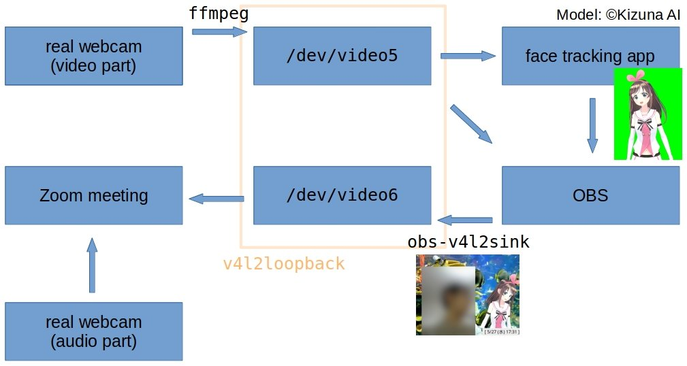
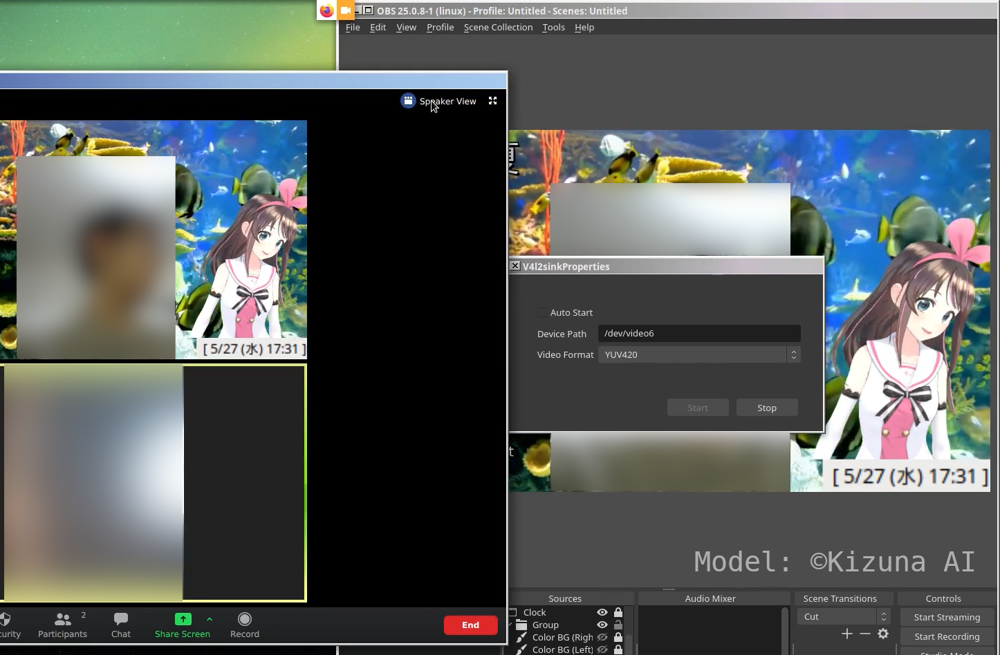

# v4l2_webcam

## About

This project makes it possible to access a single physical webcam from two or more processes. We introduce nothing new; rather this project is like a how-to.

## Requirements

- [v4l2loopback](https://github.com/umlaeute/v4l2loopback)

- [ffmpeg](https://ffmpeg.org/)

## Explanation

`v4l2loopback` creates virtual video devices which can be used as video inputs like a real webcam, but they are **not** associated with anything by default. To make them useful, you shall send streams to them via external applications. For example,

- By sending a webcam's input to a virtual video device, it can be usable as a "replica" of the webcam.

- By sending [`OBS`](https://obsproject.com/)'s output to a virtual video device with [`obs-v4l2sink`](https://github.com/CatxFish/obs-v4l2sink) plugin, you can use the output as a webcam.

This project handles the former case.

## Usage

```bash
$ source v4l2_functions.sh
$ create_video_device 5 6 #This creates `/dev/video5` and `/dev/video6`.
$ send_webcam_to_video_device 5 #This sends a webcam's input to `/dev/video5`.
```

While a physical webcam can be accessed only from a single process at a time, **a single virtual video device can be accessed by multiple processes simultaneously**. Thus, as in the example above, `/dev/video6` is just a spare device (can be omitted).

## Example

### Structure

|  |
|:-:|
| Fig: Example setup (structure). |

### Result

|  |
|:-:|
| Fig: Example setup (result). |

## Tested Environments

### OS

- Arch Linux

### Clients

- Firefox

- Chromium

- OBS

- Zoom

## Q&A

- Q. My webcam has unexpectedly low FPS (e.g. 5 FPS). How can I heighten the fps?

In our case, just plugging off and on a webcam solved the problem.

<!-- vim: set spell: -->

